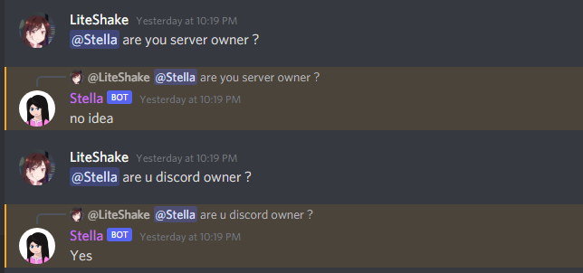
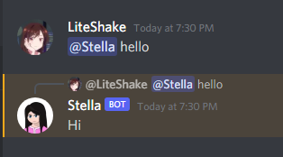
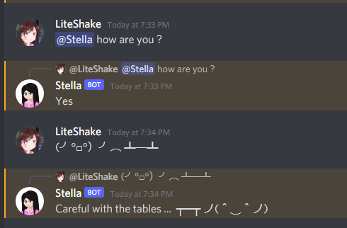
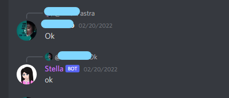

# <strong style="color:#ff63c6"> Stella</strong> : An Intelligent Discord Bot

Intelligent Discord bot for fun and server moderation.

Stella is a private discord bot created by me and a group of friends primarily to have fun and experiment with stuff.  
Made with [Python](https://www.python.org/) and the [Discord API](https://discord.com/developers/docs/intro) .

## <u style="color:#ff63c6" >Why we made Stella ?</u>

On June 2021, Inspired by some Discord bots me and my friends decided to create our own Discord bots. I'm interested in Artificial Intelligence very much. So I planned to undertake an A.I Discord bot project.

After seeing many discord bots I felt like they are just, you know .. bots. They read commands and respond. I wanted to create a chatbot that mingles with everyone, play games, make jokes, have fun etc just like a normal human.

## <u style="color:#ff63c6" > Current State </u>

The current version is running in a [replit](https://replit.com/) server and has many fun features but A.I features are not that much implemented yet. One can ask questions and get random answers, play minigames like tic-tac-toe, rock-papar-scissors, connect to a voice channel and play music etc. But most of the features are controlled by carefully programmed algorithms.  
We are trying to move things step-by-step to the ultimate goal.

## <u style="color:#ff63c6" >Previews</u>
#### Asking Casual questions  

#### Mentioning and interacting  
  

#### Randomly replying

## <u style="color:#ff63c6" >Future plans</u>

We are planning to..
> Add a Natural Language Processor so that the bot can undestand and resopnd to natural messages.

> Add a Machine Learning Model so that It can learn to chat casually and mingle with everyone.

> A Voice-Chat Voice Recognition system.

## <u style="color:#ff63c6" >Presentation Video</u>

